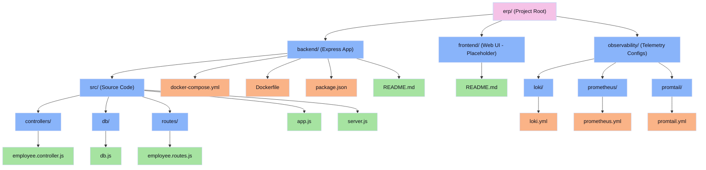
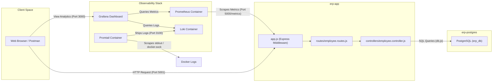

# ERP Project Folder & Architecture Diagram

This document provides a visual directory tree, a functional relationship diagram, and an explanation of the core components of the **ERP** project workspace.

---

## 1. Directory Tree

Below is the complete, high-level directory structure of the repository:

```text
erp/ (Project Root)
├── backend/                             # Express.js REST API & container orchestrations
│   ├── src/                             # Backend source code
│   │   ├── controllers/
│   │   │   └── employee.controller.js   # Request handlers and business logic
│   │   ├── db/
│   │   │   └── db.js                    # PostgreSQL database connection client
│   │   ├── routes/
│   │   │   └── employee.routes.js       # Express route handlers for employee endpoints
│   │   ├── app.js                       # Express app configuration & middleware pipeline
│   │   └── server.js                    # Application entry point to start the server
│   ├── .gitignore                       # Node/Docker patterns to ignore in git
│   ├── Dockerfile                       # Multi-stage build manifest for the backend app
│   ├── docker-compose.yml               # Multi-container orchestration (App, DB, Observability)
│   ├── package.json                     # Node.js project manifests & scripts
│   ├── package-lock.json                # Strict locks for installed dependency trees
│   └── README.md                        # Documentation of backend setup and commands
├── frontend/                            # Client-side single-page app directory
│   └── README.md                        # Front-end setup instructions (Currently a placeholder)
└── observability/                       # Shared configurations for logging & metrics
    ├── loki/
    │   └── loki.yml                     # Loki log aggregator configuration
    ├── prometheus/
    │   └── prometheus.yml               # Prometheus scraping interval and targets
    └── promtail/
        └── promtail.yml                 # Promtail log discovery and target definitions
```

---

## 2. Directory Hierarchy Diagram

This flowchart outlines the folder structure and categorized items:



---

## 3. Data Flow & Integration Diagram

Here is how the directories interact dynamically during runtime:



---

## 4. Key Components Description

| Path | Primary Responsibility | Detail |
| :--- | :--- | :--- |
| `backend/src/app.js` | Express Pipeline Configuration | Integrates essential security/utilities (cors, helmet, morgan) and the Prometheus `express-prom-bundle` middleware. |
| `backend/src/server.js` | Server Entry Point | Spins up the HTTP listener on the configured port. |
| `backend/docker-compose.yml` | Container Orchestration | Spawns and interconnects the Postgres, App, Prometheus, Loki, Promtail, and Grafana containers. |
| `observability/` | Centralized Telemetry Configs | Groups monitoring files for Prometheus, Loki, and Promtail outside of application-specific dirs. |
